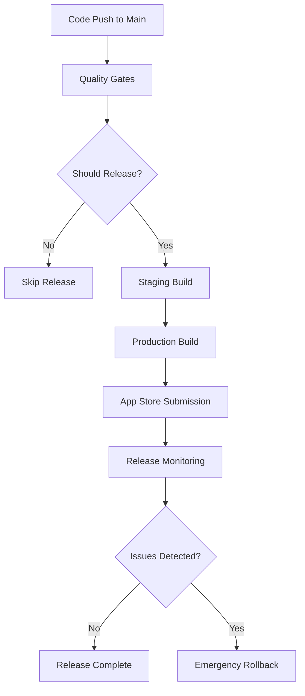

# Continuous Release Strategy for Gifted Minds

## 🚀 Overview

This document outlines the comprehensive continuous release strategy for the Gifted Minds React Native puzzle game. The system enables safe, automated deployments with proper quality gates, feature flags, and rollback capabilities.

## 📋 Release Pipeline Architecture



## 🔧 System Components

### 1. **Quality Gates Pipeline**
- **Linting**: ESLint validation with zero warnings
- **Type Safety**: TypeScript strict mode validation
- **Expo Validation**: Configuration and dependency checks
- **Web Build Test**: Ensures cross-platform compatibility
- **Puzzle Generation Test**: Validates core game logic

### 2. **Release Decision Logic**
```javascript
const shouldRelease = (
  allQualityGatesPassed &&
  hasChangesSinceLastRelease &&
  !appStoreReviewInProgress &&
  !manualHold
);
```

### 3. **Feature Flag System**
- **Remote Configuration**: JSON-based feature flag management
- **Gradual Rollouts**: Percentage-based feature enablement
- **User Segmentation**: Different flags for user groups
- **Instant Rollbacks**: Immediate feature disabling without app updates

### 4. **Monitoring & Analytics**
- **Performance Tracking**: App performance metrics
- **Feature Usage**: Feature flag effectiveness
- **Error Tracking**: Real-time error monitoring
- **Release Health**: Success/failure rates

## 🚦 Release Types

### Automatic Releases (Default)
- **Trigger**: Push to main branch
- **Conditions**: 
  - All quality gates pass
  - Changes detected since last release
  - No App Store review in progress
- **Process**: Staging → Production → App Store submission

### Manual Releases
- **Trigger**: `workflow_dispatch` in GitHub Actions
- **Options**:
  - `patch`: Bug fixes (1.0.0 → 1.0.1)
  - `minor`: New features (1.0.0 → 1.1.0)
  - `major`: Breaking changes (1.0.0 → 2.0.0)
- **Emergency Override**: Can skip tests if needed

### Emergency Rollbacks
- **Feature Flags Only**: Disable problematic features instantly
- **Version Rollback**: Revert to previous version with emergency build
- **Emergency Disable**: Disable all non-essential features

## 📱 App Store Integration

### Review Status Monitoring
```bash
npm run check-review  # Check current review status
```

### Build Management
```bash
npm run build:preview    # Preview builds for testing
npm run build:all        # Production builds for both platforms
npm run submit:all       # Submit to both app stores
```

### Smart Release Logic
- **Monitors App Store review queue**
- **Only releases when no reviews are pending**
- **Automatic retry with backoff for failed submissions**

## 🎛️ Feature Flag Management

### Configuration Structure
```json
{
  "version": "1.0.0",
  "flags": {
    "newFeature": true,
    "experimentalFeature": false
  },
  "rolloutPercentage": {
    "experimentalFeature": 25
  },
  "userSegments": {
    "early_adopters": {
      "experimentalFeature": true
    }
  }
}
```


## 📊 Monitoring & Observability

### Performance Monitoring
```typescript
import { monitoring } from '@/lib/monitoring';

// Track performance metrics
monitoring.trackPerformance('puzzle_generation_time', duration);

// Track user events
monitoring.trackEvent('puzzle_completed', { type: 'analogy', score: 85 });

// Track errors
monitoring.trackError(error, { context: 'puzzle_generation' });
```

### Release Health Metrics
- **Crash Rate**: < 0.1% target
- **ANR Rate**: < 0.05% target
- **Error Rate**: < 1% target
- **Success Rate**: > 99% target

### Monitoring Commands
```bash
npm run monitoring:export  # Export local analytics data
npm run monitoring:clear   # Clear local analytics cache
```

## 🚨 Emergency Procedures

### Feature Flag Rollback
1. **Immediate**: Update `config/feature-flags.json` and push
2. **Automated**: Run rollback workflow with "feature_flags_only"
3. **Result**: Features disabled within 5 minutes for all users

### Version Rollback
1. **Identify Target**: Previous stable version
2. **Execute Rollback**: GitHub Actions workflow
3. **Emergency Build**: Automatic build and store submission
4. **Timeline**: 30-60 minutes for full rollback

### Rollback Workflow
```bash
# Via GitHub Actions UI:
# 1. Go to Actions → Emergency Rollback
# 2. Select rollback type
# 3. Provide reason
# 4. Execute
```

## 📈 Release Metrics & KPIs

### Deployment Frequency
- **Target**: Multiple deployments per day
- **Current**: Daily releases when changes exist

### Lead Time
- **Target**: < 2 hours from code to production
- **Components**:
  - Quality Gates: ~10 minutes
  - Build: ~20 minutes
  - Store Processing: Variable (hours to days)

### Mean Time to Recovery (MTTR)
- **Feature Flag Issues**: < 5 minutes
- **Version Rollback**: < 60 minutes
- **Emergency Disable**: < 2 minutes

### Change Failure Rate
- **Target**: < 5%
- **Tracking**: Release health monitoring
- **Response**: Automatic rollback triggers

## 🔄 Continuous Improvement

### Weekly Release Review
- Analyze release metrics
- Review feature flag effectiveness
- Identify improvement opportunities
- Update rollout strategies

### Monthly Architecture Review
- Evaluate pipeline performance
- Update quality gates
- Refine monitoring strategies
- Plan infrastructure improvements

## 🛠️ Setup Instructions

### 1. Initial Setup
```bash
# Install dependencies
npm ci

# Setup EAS authentication
eas login
eas build:configure

# Setup automation
npm run setup-automation
```

### 2. Environment Configuration
Required GitHub Secrets:
- `EXPO_TOKEN`: EAS CLI authentication
- `CLAUDE_CODE_OAUTH_TOKEN`: Claude AI integration
- App Store Connect API credentials

### 3. Configuration Setup
```bash
# Configuration is handled automatically via App Store Connect
# No additional setup required
```

### 4. Monitoring Setup
```bash
# Test monitoring integration
npm run monitoring:export

# Verify analytics collection
node -e "require('./lib/monitoring').monitoring.trackEvent('test', {})"
```

## 📚 Best Practices

### Code Quality
- All code must pass TypeScript strict mode
- ESLint with zero warnings policy
- Comprehensive error handling
- Performance-conscious development

### Feature Development
- Use feature flags for all new features
- Start with small rollout percentages
- Monitor metrics before full rollout
- Plan rollback strategies

### Release Management
- Test in staging environment first
- Monitor App Store review status
- Coordinate releases with marketing
- Prepare rollback plans

### Incident Response
- Use feature flags for immediate mitigation
- Document all incidents and responses
- Conduct post-incident reviews
- Update procedures based on learnings

---

## 🆘 Quick Reference

| Scenario | Command | Timeline |
|----------|---------|----------|
| Check release status | `npm run check-builds` | Immediate |
| Emergency feature disable | `npm run feature-flags:safe && git push` | 5 minutes |
| Version rollback | GitHub Actions → Emergency Rollback | 60 minutes |
| Monitor app health | `npm run monitoring:export` | Immediate |
| Check store review | `npm run check-review` | Immediate |

For detailed troubleshooting, see [TROUBLESHOOTING.md](./TROUBLESHOOTING.md)